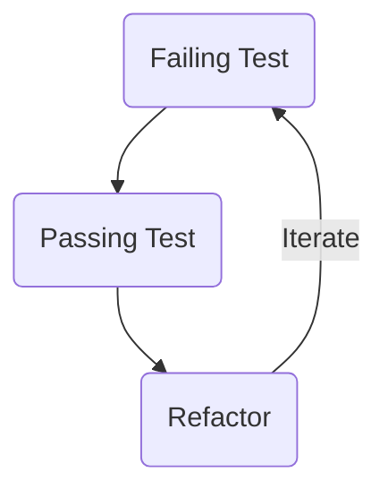

# Welcome to your interview with Nimbuspay Technologies.

Your interview will comprise a short conversation about your experience and a pair programming exercise with two of our
senior engineers, one of whom will be your co-pilot whilst you complete a simple code kata.

The exercises are designed to be simple and straight forward, it is not expected that you will fully complete the chosen
task in the time available.

### For this you will need the following before joining

* A computer capable of running your chosen java IDE
* A modern version of Java installed (at least java 17)
* The ability to share your screen during the call (the complete screen not just the IDE window)
* A working git command
* A good, reliable internet connection

### Exercise 
The task you are asked to complete will be one of the code katas found on https://codingdojo.org/kata/ and as with all 
code kata, it should be completed using a TDD approach.

